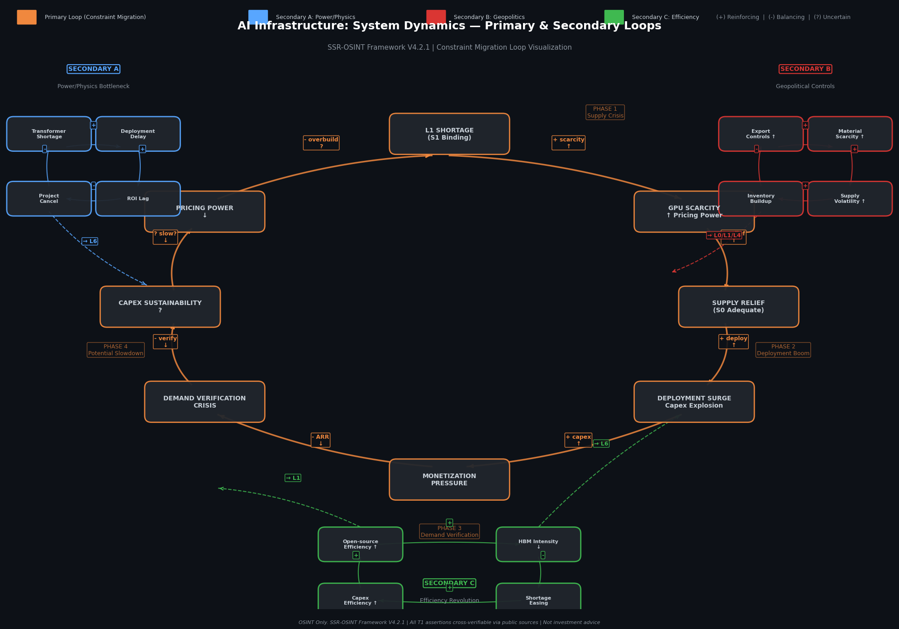

# AI Infrastructure: The Constraint Migration Loop — Framework Definition and Methodology Note

**Date:** 29 May 2026  
**Framework Version:** SSR-OSINT V4.2.1  
**Insight Type:** Framework / Methodology Disclosure  
**Reading Time:** ~6 min  
**Tags:** #SystemDynamics #AIInfrastructure #ConstraintLoop #Methodology #OSINT

---

## TL;DR

- The AI infrastructure system is governed by a single dominant feedback loop rather than a collection of independent risks. We refer to this framework as the **Constraint Migration Loop**:

  **Supply Shortage → Supply Relief → Deployment Surge → Monetization Pressure → Demand Verification**

- Three secondary loops influence the speed and direction of the primary loop:

  - **Loop A (Power & Physical Infrastructure)** introduces deployment friction.
  - **Loop B (Geopolitics & Trade Controls)** reintroduces supply volatility.
  - **Loop C (Efficiency & Architecture Improvements)** can compress or partially bypass the sequence.

- The objective of this framework is to provide a systematic method for organizing observable signals across the AI infrastructure stack.

## Master Loop Diagram



*Figure 1: Constraint Migration Loop. Orange = Primary Loop (4 phases). Blue = Secondary A (Power/Physics). Red = Secondary B (Geopolitics). Green = Secondary C (Efficiency). (+) = reinforcing, (-) = balancing, (?) = uncertain.*
---

## 1. Core Definitions

To map signal flows across the technology, geopolitical, and physical layers, this framework relies on five system-dynamics concepts:

### Constraint

Any capital, logistical, physical, or regulatory bottleneck that limits the deployment or monetization of compute.

### Binding Constraint

The single bottleneck currently governing system throughput and performance.

### Constraint Migration

The non-linear movement of the binding constraint from one node to another following relief of a previous bottleneck.

### Re-Binding

An event, typically geopolitical or physical in nature, that causes a previously resolved bottleneck to become binding again.

### Secondary Loops

Modulating mechanisms that do not replace the primary loop but alter its speed, volatility, or direction.

---

## 2. The Four-Phase Cycle

The primary loop describes how the binding constraint moves through the AI infrastructure system over time.

```text
[Phase 1: L1 Shortage]
            ↓
[Phase 2: Deployment Surge]
            ↓
[Phase 3: Monetization Pressure]
            ↓
[Phase 4: Supply Overbuild]
```

### Phase 1 — L1 Shortage (Hardware Scarcity & Pricing Power)

**Theoretical Trigger**

Demand for silicon, advanced packaging, and memory exceeds near-term manufacturing capacity.

**System Behavior**

Hardware suppliers maintain pricing power while buyers prioritize allocation over unit economics.

**Methodological Interpretation**

As supply-relief indicators emerge, Phase 1 variables become less informative than transition signals between Phase 2 and Phase 3.

---

### Phase 2 — Supply Relief & Deployment Surge

**Theoretical Trigger**

Primary hardware bottlenecks are partially or fully relieved.

**System Behavior**

Previously delayed deployments accelerate, producing a capital expenditure expansion as organizations attempt to absorb accumulated demand.

**Methodological Interpretation**

Headline CapEx figures often combine AI and non-AI spending. Analysts should distinguish infrastructure volume from deployment velocity when assessing sustainability.

---

### Phase 3 — Monetization Pressure & Demand Verification

**Theoretical Trigger**

Rapid deployment increases available compute capacity and places downward pressure on pricing.

**System Behavior**

The focus shifts from securing hardware supply to evaluating whether downstream revenues justify infrastructure costs.

**Methodological Interpretation**

Public disclosures and subsequent public commentary may produce differing interpretations regarding contract structures or revenue visibility. Under this framework, the key variable is revenue durability rather than any individual contractual detail.

---

### Phase 4 — Demand Verification Crisis & Supply Overbuild

**Theoretical Trigger**

Downstream revenue generation fails to support the capital deployment trajectory established during Phase 2.

**System Behavior**

CapEx growth slows, excess inventory accumulates, and market narratives transition from scarcity to oversupply.

**Methodological Interpretation**

This phase represents a potential reversal rather than a predetermined outcome.

---

## 3. Secondary Loops

Secondary loops operate simultaneously with the primary loop and influence transition speed, volatility, and persistence.

```text
           [Loop B]
    Geopolitical Controls
                │
                ▼

[Primary Constraint Migration Loop]
                ▲
                │

 [Loop C]               [Loop A]
 Efficiency         Power & Physics
```

### Loop A — Power & Physical Infrastructure

Examples include:

- Transformers
- Grid interconnections
- Substations
- Backup generation systems

**Framework Function**

Deployment delays create a lag between capital expenditure and revenue realization, increasing monetization pressure.

---

### Loop B — Geopolitical Controls

Examples include:

- Export controls
- Trade restrictions
- Materials embargoes
- Entity-list actions

**Framework Function**

Acts as a re-binding mechanism capable of reintroducing supply constraints even after prior bottlenecks have eased.

---

### Loop C — Efficiency Revolution

Examples include:

- Algorithmic improvements
- Model compression
- Training optimization
- Hardware-efficiency gains

**Framework Function**

Potentially short-circuits the primary sequence by reducing hardware intensity while simultaneously easing monetization pressure.

---

## 4. Observable Indicators

The framework organizes observable signals according to transition stages.

| Transition Stage | Observable Indicators | Interpretation |
|-----------------|-----------------------|---------------|
| **Phase 1 → Phase 2** | CoWoS lead times, labor stability, HBM allocation | Indicates easing silicon supply constraints |
| **Phase 2 → Phase 3** | Hyperscaler CapEx trends, optical transceiver shipments, transformer lead times | Indicates transition from procurement to deployment |
| **Phase 3 → Phase 4** | ARR growth, audited free cash flow, AI-specific CapEx growth rates | Indicates whether deployment is economically sustainable |

---

## 5. Framework Limitations

### Proprietary Yield Gaps

The framework relies exclusively on public information and cannot observe proprietary foundry yields or private procurement allocations.

### Unobservable Buffers

Certain inventory buffers, including localized material stockpiles and operational reserves, remain structurally opaque.

### Non-Linear Geopolitics

The framework can map mechanisms through which geopolitical constraints propagate but cannot predict the timing or motivation of policy decisions.

---

## 6. Relationship to Subsequent Notes

This Framework Note establishes the analytical architecture used throughout the AI Infrastructure research series.

Subsequent notes apply the framework to specific domains, including:

- HBM supply dynamics
- Helium logistics
- Efficiency-driven demand shifts
- Physical infrastructure constraints
- Materials and trade geopolitics

---

## Compliance Disclaimer

### MNPI Statement

This Framework Note is based exclusively on Open-Source Intelligence (OSINT) derived from publicly available and legally accessible sources. No material non-public information was used in its preparation.

### Conflict of Interest

The Insight Provider has no position in, and does not intend to initiate a position in, any securities referenced herein. No compensation was received from any entity to produce this research.

### Jurisdiction

This note is provided for informational and discussion purposes only. It does not constitute investment advice or a recommendation to buy, sell, or hold any security.

### Framework Declaration

The Constraint Migration Loop is an analytical framework derived from publicly observable signals and constraints. It is designed as an organizational methodology and should not be interpreted as a predictive model or probability forecast.

---

*OSINT Only.*

**#SystemDynamics #AIInfrastructure #ConstraintLoop #Methodology #OSINT**


*End of Insight*


# Node / Report
## AI Investment Paradox: Supply Chain Inflation vs. Efficiency Deflation

**Date:** 2026-05-28 | **OSINT Cut-off:** 2026-05-28 20:00 KST

**AICS System Disclosure**  
This note is a node within the AICS v1.0 constraint mapping system. Nodes are not standalone opinions and are intended for informational purposes only.

### Executive Summary

The AI supply chain remains in the AIPI-C pressure band, with attribution shifting from a "three-pole active" state to supply rigidity dominant (easing direction).

Samsung’s wage deal passed with 73.7% approval on 27 May, removing the most immediate supply disruption risk — the single largest change this period.

On the demand side, Anthropic’s $43–47B compute framework contract with SpaceX remains the dominant incremental anchor for AI capex expectations.

Geopolitically, China’s rare earth export halt to Japan continues into its fourth month, while Japan is reportedly considering expanding semiconductor material controls to South Korea.

Overall: system pressure is easing, but structural uncertainty remains elevated.

### 1. Verified Signal Set

#### 1.1 Supply
- **T1 Confirmed:** Samsung union wage deal passed (73.7%, 46,185/57,290). Strike crisis formally resolved. Turnout: 95.5% (Yonhap, Donga Ilbo)
- **T2 Inferred:** 2026 HBM capacity fully sold out across Samsung / SK Hynix / Micron. No intra-year supply elasticity remains.
- **T2 Inferred:** Immediate bottleneck remains HBM3e 12H for Blackwell Ultra deployment.
- **T1 Confirmed:** TSMC Q1 impacted by 2025 earthquake (-11.3% MoM Feb revenue). AMD >$10B Taiwan investment reinforces L0 concentration.

#### 1.2 Demand
- **T2 Inferred:** Anthropic committed $43–47B compute framework contract with SpaceX (2026–2029).
- **T2 Inferred:** Funding structure and payment guarantees remain unverified via public financial disclosures.
- **T3 Speculative:** Frontier AI labs may accelerate similar compute pre-commitments, tightening mid-cycle demand elasticity.

#### 1.3 Geopolitics / Materials
- **T1 Confirmed:** China exported zero heavy rare earths to Japan since Dec 2025; APEC request rejected (Reuters)
- **T2 Inferred:** Japan considering expansion of semiconductor material export controls to South Korea (pending METI confirmation)
- **T3 Speculative:** Multi-node material control regimes may emerge across Northeast Asia, increasing systemic fragmentation risk.

#### 1.4 Physical Layer
- **T1 Confirmed:** Strait of Hormuz transits recovered to 23/week (~15% pre-crisis baseline)
- **T2 Inferred:** Helium supply remains structurally tight due to Russian export controls (through 2027)
- **T3 Speculative:** Any Hormuz disruption would immediately re-tighten global helium logistics.

### 2. Constraint Map
- **HBM (L1–L2):** Demand rigid, capacity fully allocated
- **Advanced Packaging:** CoWoS-L lead time remains extended
- **Optical Interconnects:** EML supply deficit ~30%
- **Helium (L4):** Russia + Hormuz dual constraint
- **Geopolitical Materials (L4):** China–Japan + Japan–Korea emerging axis

### 3. Actor Exposure Map

**Exposed:**  
- NVIDIA, AMD (chip designers reliant on HBM supply)  
- Hyperscalers (compute cost escalation)  
- Japanese material producers (rare earth input dependency)  
- Global helium users

**Constraining:**  
- US (export controls)  
- China (rare earth policy)  
- Japan (material policy)  
- Russia (helium export controls)

### 4. Risk Decomposition

System shifts from “three-pole active” → supply rigidity dominant (easing mode).

- **Most underestimated:** efficiency-driven HBM intensity reduction (no validation yet)  
- **Most overestimated:** near-term Rubin/HBM4 cost shock (18+ months away)  
- **Emerging:** Japan–Korea material controls as next L4 shock vector

### 5. Watch Signals
- **Japan METI** Korea material control announcement  
- **Anthropic Q2** financial disclosure  
- **China May** rare earth export data (5th consecutive zero export risk)  
- **HBM per compute** efficiency regression (>40% threshold)

**Disclaimer:** This report is an independent OSINT-based strategic analysis for informational purposes only. It does not constitute investment advice.

---

# Node / Report
## Samsung Electronics: Strike Deal Passes, HBM Supply Focus Shifts to Structural Tightness

**Date:** 2026-05-28 | **OSINT Cut-off:** 2026-05-28 20:00 KST

**AICS System Disclosure**  
This note is a node within the AICS v1.0 constraint mapping system. Nodes are not standalone opinions and are intended for informational purposes only.

### Executive Summary

Samsung’s labour dispute is formally resolved following 73.7% approval of the wage agreement (27 May).

This removes the primary short-term supply disruption risk in the global HBM chain.

However, structural constraints remain unchanged:
- 2026 HBM capacity is fully sold out
- No intra-year supply elasticity exists
- Geopolitical material constraints are shifting outward

Focus shifts from “strike risk” → “yield + geopolitics”

### 1. Verified Signal Set

#### 1.1 Labour
- **T1 Confirmed:** Wage deal passed 73.7% approval (Yonhap / Donga Ilbo)
- **T1 Confirmed:** Vote turnout 95.5%
- **T2 Inferred:** Near-term strike probability collapses, but structural labor tension persists via internal bonus distribution gaps

#### 1.2 Supply (HBM)
- **T2 Inferred:** 2026 HBM capacity fully allocated across top 3 suppliers
- **T2 Inferred:** Bottleneck remains HBM3e 12H for Blackwell Ultra
- **T2 Inferred:** HBM4 volume production unlikely before 2027–2028
- **T3 Speculative:** Yield improvement trajectory may shift competitive balance (no confirmed data)

#### 1.3 Geopolitics
- **T1 Confirmed:** Strike geopolitical pressure factor reduced (0.75 → 0.70 in model)
- **T2 Inferred:** US export controls remain structural constraint on Samsung China exposure
- **T2 Inferred:** Japan considering semiconductor material controls targeting South Korea
- **T3 Speculative:** Dual US–Japan pressure could constrain Samsung’s allocation flexibility

### 2. Constraint Map
- **Immediate:** resolved strike risk
- **Structural:** full HBM capacity allocation
- **External:** US export controls + Japan material risk
- **Internal:** compensation imbalance friction persists

### 3. Actor Exposure Map

**Exposed:**  
- NVIDIA, AMD (HBM supply dependency)  
- Hyperscalers (compute cost exposure)  
- KOSPI index (Samsung systemic weight)

**Constraining:**  
- US (export control regime)  
- Japan (material control policy)  
- SK Hynix / Micron (competitive supply pressure)

### 4. Risk Decomposition

**Shift:** Suspended stress → structural constraint regime

- Strike risk removed (short-term tail risk cleared)  
- Supply tightness remains hard-bound  
- External geopolitical friction becomes dominant marginal driver

### 5. Watch Signals
- **Japan METI** material controls (Korea)  
- **Samsung HBM3e** yield curve  
- **Bonus distribution** execution path  
- **US-China HBM** export restriction trajectory

**Disclaimer:** This report is an independent OSINT-based strategic analysis for informational purposes only. It does not constitute investment advice.

---

# Node / Report
## Semiconductor Materials: China–Japan Rare Earth Stalemate and Expanding Material Control Risk

**Date:** 2026-05-28 | **OSINT Cut-off:** 2026-05-28 20:00 KST

**AICS System Disclosure**  
This note is a node within the AICS v1.0 constraint mapping system. Nodes are not standalone opinions and are intended for informational purposes only.

### Executive Summary

China’s rare earth export halt to Japan has entered its fourth consecutive month, while Japan is considering expanding semiconductor material controls to South Korea.

This signals a transition from bilateral trade friction → regional material weaponisation architecture.

Simultaneously, helium supply remains structurally tight due to Russia + Hormuz constraints.

Result: L4 materials layer fragmentation intensifies.

### 1. Verified Signal Set

#### 1.1 Rare Earths
- **T1 Confirmed:** Zero exports of dysprosium / terbium / gallium since Dec 2025
- **T1 Confirmed:** Japan APEC request rejected (Reuters)
- **T1 Confirmed:** China dual-use export controls expanded to 1,030 tariff codes
- **T2 Inferred:** Stalemate has become institutionalised rather than cyclical

#### 1.2 Japan–Korea Risk
- **T2 Inferred:** Japan may extend material export controls to South Korea
- **T3 Speculative:** Potential cascade into regional semiconductor decoupling regime
- **T3 Speculative:** Secondary retaliation from Korea possible (low probability but high impact tail)

#### 1.3 Helium / Physical Layer
- **T1 Confirmed:** Russia helium export controls (2026–2027)
- **T1 Confirmed:** Hormuz transit recovery remains partial (~15% baseline gap)
- **T2 Inferred:** Helium pricing remains structurally elevated (RMB 310–360/m³)
- **T3 Speculative:** Logistics rerouting cannot fully offset supply rigidity

### 2. Constraint Map
- **Rare earths:** structural supply cutoff
- **Gallium/germanium:** zero-flow regime
- **Japan–Korea:** emerging control axis
- **Helium:** dual-shock supply constraint

### 3. Actor Exposure Map

**Exposed:**  
- Japanese materials firms (rare earth input dependency)  
- Korean foundries (Samsung, SK Hynix)  
- Global semiconductor supply chain

**Constraining:**  
- China (rare earth export regime)  
- Japan (trade policy)  
- Russia (helium export controls)  
- Hormuz logistics (shipping disruption risk)

### 4. Risk Decomposition

**Shift:** Bilateral friction → multi-node supply constraint system

- Rare earth stalemate becoming structural baseline  
- Material controls expanding geographically  
- Constraints increasingly compounding (not independent)

**Most important dynamic:** cross-layer reinforcement of L4 bottlenecks

### 5. Watch Signals
- **Japan METI** Korea export control announcement  
- **China May** rare earth export data (5th consecutive zero export risk)  
- **Hormuz transit** recovery trend  
- **China helium** domestic capacity ramp (Shanxi Phase II)

**Disclaimer:** This report is an independent OSINT-based strategic analysis for informational purposes only. It does not constitute investment advice.
